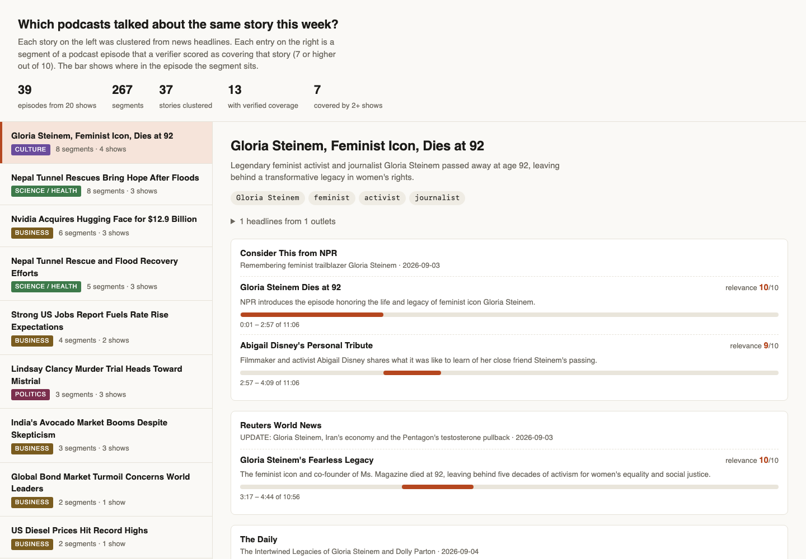
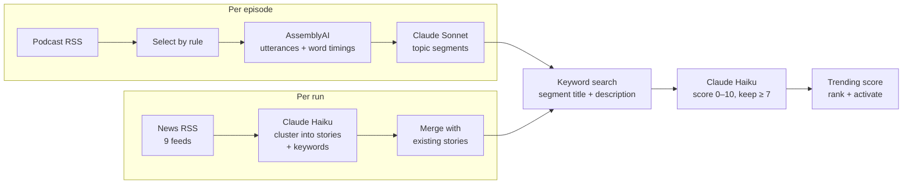

# convos-pipeline

Given a list of podcast feeds and a list of news feeds, find the moments where different shows discuss the same story.

This is the backend pipeline from [Convos](https://convospodcasts.com), a podcast app I'm building. The app is not here; the pipeline is, standalone and runnable: transcribe episodes, split them into topical segments with Claude, cluster news headlines into stories, and verify which segments cover which stories.

**If you have sixty seconds:** open [`samples/REPORT.md`](samples/REPORT.md). It is the unedited output of one run over 39 episodes from 20 news podcasts published 2–4 September 2026. Each story lists the shows that covered it, the exact segment, the timestamp, and the verifier's score. [`samples/episodes/`](samples/episodes/) has every episode's segments and transcript. `viz/index.html` shows the same thing interactively if you open it locally.

Then read [Where it breaks](#where-it-breaks). That section is the point of publishing this.



## What it does



Every stage writes JSON to `data/` and skips work that already has output, so an interrupted run resumes without paying twice.

## The approach

### Segmentation: a model that reads the whole episode decides where topics change

The segmenter receives the entire transcript as timestamped speaker turns, plus the feed's title, description, and duration. It returns a list of start times, each with a three-to-seven-word title written like a magazine headline and a one-sentence description. The prompt ([`prompts/segment.md`](prompts/segment.md)) scales the expected segment count with episode length and spends most of its words on paired examples of bad and good titles. The examples do the work; the rules are short.

I chose model-drawn boundaries over fixed windows or embedding change-point detection for one reason: the segments are the app's navigation unit, so they have to be boundaries a listener would agree with *and* carry titles worth tapping. A change-point detector gives boundaries but no titles, and the boundaries it finds (lexical shifts) are not the ones people navigate by. One model call that sees everything does both at once, and it can use the episode description to know what the show is about before the hosts get to it.

What the model is not trusted with is handled in code ([`src/segment.ts`](src/segment.ts)):

- **The first segment starts at 0:00** whatever the model says. Every episode has a top.
- **Starts snap to the nearest utterance boundary** when one is within 30 seconds, so a segment never begins mid-sentence. Ends are the next segment's start.
- **Utterances longer than 45 seconds are split at sentence ends using word timings** before the model sees them. Diarization returns one utterance for a whole monologue on single-host shows, and without timestamps inside it the model has nothing to anchor boundaries to. This was found on this run; see below.
- **A 15-word anchor phrase is captured at each start.** The audio a listener downloads is not the audio that was transcribed: dynamic ad insertion pads episodes by a varying amount. On this run the transcribed audio was up to 7.8 minutes longer than the feed's declared duration (median about 1.7 minutes). The app runs on-device speech recognition near the expected time and searches for the anchor phrase to re-align. Recording it at generation time costs nothing.

Sonnet is used here because the task is generative and its quality is visible in every title. The two remaining model calls are classification-shaped and go to Haiku at temperature 0.

### Stories: "same story" has an operational definition

Headlines come from nine public feeds (BBC sections, NPR, Ars Technica, Google News). They are deduplicated on title plus source and handed to Haiku 75 at a time, newest first. The prompt ([`prompts/cluster-stories.md`](prompts/cluster-stories.md)) asks for groups of at least two headlines, at most ten groups per call, and for each group a title, a summary, a category, and three to six keywords that are proper nouns or event names, explicitly not generic words. The keywords exist for retrieval; the title and summary exist for the reader.

Each new cluster is merged into the running story list by one rule: if it shares two or more keywords (exact match, case-insensitive) with a live story, it *is* that story, and the headlines and keywords are unioned. Otherwise it becomes a new story. In production this ran every 30 minutes and stories accumulated across a day; the standalone command runs the batches back to back.

So, operationally: a story is a set of headlines the clusterer grouped, identified by its keyword set, and two clusters are the same story when they share two keywords. That is a deliberately blunt rule. Both of its failure directions show up in the sample and are catalogued below.

### Matching: cheap recall, then a model for precision

For each story, stage one is lexical: any story keyword appearing as a substring of a segment's title or description makes that segment a candidate. No transcript text is searched, no embeddings are involved. In production this was a `LIKE` query over the segments table; here it is an in-memory scan ([`src/match.ts`](src/match.ts)). Candidates are capped at 200, newest episodes first.

Stage two is one Haiku call per story ([`prompts/verify-match.md`](prompts/verify-match.md)): every candidate's episode title, segment title, and description, scored 0–10 against the story title. Only 7 and above survive, where 7–8 means "discusses the same topic in depth" and 9–10 means "directly discusses this exact event".

The shape is deliberate. Stage one is free and has good recall for proper nouns, which is exactly what the keyword prompt asks for. Stage two is where precision comes from, and it is cheap because it reads about fifty tokens per candidate. A segment "covers" a story when it contains a keyword *and* the verifier rates it 7 or better.

### Ranking

```
trending = matches × mean relevance × (1 + 0.2 × distinct shows) × 0.5 ^ (age in days / 3)
```

Coverage by several different shows is rewarded on top of raw match count because the product promise is "every show covering this", not "the show that covered it most". A story becomes active on its first verified match and is archived when its score decays under 0.5. The activation threshold was two matches until a production run showed a sparsely-transcribed catalog kept the feature empty; it was lowered to one. That is the kind of knob this pipeline has instead of an eval set, which is one of the limitations below.

### Cost shape

Per episode: one transcription (billed by audio hour) and one Sonnet call whose input is the whole transcript. Per run: one Haiku call per 75 headlines and one Haiku call per story. The sample run's `run.json` records 14.4 hours of audio and the exact Claude token counts; at list prices the Claude portion of the whole run was under $3.

Production had one more cost control that is not in the standalone CLI because it needs a catalog to be selective over: only a seeded set of shows had recent episodes transcribed automatically, and other episodes were transcribed on demand when two or more of a story's keywords hit the episode title, capped at ten per day. The stories drove the transcription budget, not the other way round.

## What came out of the sample run

Run on 4 September 2026 with the configuration in `feeds.json`. Full output is in [`samples/`](samples/), and [`viz/screenshot.png`](viz/screenshot.png) shows the interactive view.

| | |
|---|---|
| Episodes | 39 from 20 shows, published 2–4 September, 14.4 hours of audio |
| Segments | 267, from 20 seconds to 8.5 minutes long |
| Headlines | 270 from 9 feeds, clustered in 4 batches |
| Stories | 37, of which 13 have verified podcast coverage and 7 are covered by two or more shows |
| Verified matches | 45 |
| Claude cost | $1.06 at list price: segmentation $0.99, clustering $0.04, verification $0.02 |
| Wall time | about nine minutes, most of it transcription and segmentation running four calls at a time |

The result the pipeline exists to produce, taken from `REPORT.md`:

**Nvidia acquires Hugging Face for $12.9 billion.** Three headlines from three outlets became one story. Its keywords pulled 41 candidate segments; the verifier kept six, across three shows:

| Show | Segment | Time | Score |
|---|---|---|---|
| Tech Brew Ride Home | Nvidia's $12.9B Hugging Face Bet | 0:03–4:00 | 10 |
| Tech Brew Ride Home | The $399 Duck Changes Everything | 4:00–8:16 | 9 |
| Tech Brew Ride Home | Why 86x Revenue Makes Sense | 8:16–12:09 | 9 |
| Reuters World News | Nvidia's $13 Billion AI Gamble | 5:17–6:45 | 9 |
| Reuters World News | Open Source vs. China's AI Push | 6:45–7:27 | 9 |
| FT News Briefing | Nvidia Swallows the AI Ecosystem | 7:36–11:30 | 9 |

The 35 rejected candidates include The Intelligence's episode on Nvidia as "the bank of AI" (vendor financing, not the acquisition) and The Daily's episode on an AI-agent attack on Hugging Face. Both mention the right companies for the wrong story, and both were scored below 7. That is stage two doing its job.

Gloria Steinem's death was found in 8 segments across 4 shows, the Nepal tunnel rescue in 8 across 3, the August jobs report in 4 across 2, and the Lindsay Clancy mistrial in 3 across 3.

## Where it breaks

Everything below was observed on the sample run, and the sample was left as it came out.

### Clustering

- **Two stories for one event.** "Nepal Tunnel Rescues Bring Hope After Floods" and "Nepal Tunnel Rescue and Flood Recovery Efforts" are the same story from different batches. Their keyword sets are `Nepal, floods, tunnel rescues, China, survivors` and `Nepal, tunnel collapse, flash floods, rescue`. Exact-match overlap is one word, the merge rule needs two, so they never merged, and the same five segments were matched to both. Stemming would have caught it; so would showing the clusterer the existing story list, at the cost of a longer prompt.
- **One story for two events.** The merge rule fails the other way too. "Volkswagen Cuts 50,000 Jobs" carries the keywords `Uber, robotaxis, UK` because a cluster about Uber and driver unions shared `job cuts` and `UK` with it, and "Trump's Peace Envoys Visit Moscow and Kyiv" absorbed a Russian drone attack on Kyiv. Two shared keywords is too low a bar when the keywords are that generic.
- **Umbrella stories.** The prompt asks for at most ten stories per call and at least two headlines each, so the tail of every batch gets forced into groups like "Smart Home and Tech Gadgets Advance", "Music Festivals and Entertainment Highlights", and "Paleontology Discoveries: Antarctica and Stonehenge". They are harmless here because nothing matches them, but they are not stories. The at-least-two rule is also not enforced in code: the Steinem story has one headline.
- **Keywords that cannot retrieve anything.** `$12.9 billion`, `50000 jobs`, `August`, `Nikkei Asia`. The prompt asks for proper nouns and events; the model pads the list anyway.
- **Temperature 0 is not reproducibility.** Two runs nine minutes apart over the same 270 headlines produced 36 and 37 stories with different titles and keyword sets, and therefore different candidates and matches for the same event ("Stock Market Reacts to Jobs Report" with five matches became "Strong US Jobs Report Fuels Rate Rise Expectations" with four). Batch composition decides what the clusterer sees, and nothing pins it.

### Retrieval

- **The headline feeds do not cover the podcasts' beat.** This week's shows spent more segments on the arrest of an ICE agent (7 shows), New York's school AI ban (5), the Venezuela oil deal (5), the Iran strikes (5), and Meta's settlement (4) than on anything that became a story. None of those became stories, because BBC sections plus Google News top stories plus a ten-item NPR feed underrepresent US domestic and business news at the moment of the run. The story side is only as good as its headline sources, and these were chosen for being free and stable, not for matching the catalog. Adding US-domestic feeds is the obvious fix; so is the production habit of clustering every 30 minutes so stories accumulate across a day.
- **Two production bugs, found here.** Keyword search was a substring match (`LIKE '%AI%'` in production). The keyword `AI` therefore matched 124 of 267 segments through "said", "raise", and "Haiti", and every story that inherited `AI` through a merge sent 126 candidates to the verifier. With that many candidates the verifier began returning list positions in the `convoIdx` field, and since the code matched results back by `(episodeId, convoIdx)`, all of them were dropped: the Nvidia story verified 0 of 126. Whole-word matching and index-addressed results fixed both, and the sample was produced after the fix. The "Discover sparsity" that production tuned around by lowering the activation threshold was, I now think, partly this.
- **It is still keyword search.** Recall depends on a story's proper nouns appearing verbatim in a segment's title or one-sentence description; transcript text is never searched. A segment that discusses a story without naming it the way the headlines did is invisible. Embeddings over segment descriptions are the next step and were never wired in: the app's backend had no vector store and this was a weekend feature.

### Verification

- **Seven is too low and eight is too high.** Every false positive in the sample scored exactly 7: "India's Avocado Market Booms" matched three unrelated agriculture segments, "UK Drought Crisis" matched a Georgia timber farmer switching to blueberries, "El Niño" matched UK energy traders, and the mis-merged Volkswagen story matched Uber's layoffs. Every score of 8 or above is correct. Raising the threshold to 8 would remove those six false positives and three true matches (Nepal's hydropower bet, the jobs-report preview, freight moving to rail). The threshold stays at 7, the production value; the number that matters is that 6 of 45 matches are wrong.
- **It cannot see depth.** The verifier reads a title and one sentence per candidate, so an episode's cold open ("Meet Darrell Duffie", "Two Icons, One Week") scores as high as the ten-minute discussion that follows. Ranking by score does not rank by how much of the story a listener will hear.

### Segmentation

- **The count guideline is advisory.** The prompt suggests 3–5 segments for a 10–30 minute episode; 28 of 39 episodes came back above their band. For news roundups that is probably right (a 13-minute Up First has four stories plus intros) and the guideline is wrong, but nothing measures it either way.
- **Intros and ad reads.** 15 of 39 episodes open with a segment that is an intro or headline preview. On single-host shows an ad read in the middle of a topic is absorbed into that topic's segment; one anchor phrase in the sample begins "with at&t connected car, your eligible vehicle".
- **Monologues broke it until this run.** Diarization returned one utterance for a 19-minute single-host episode, so the transcript the model saw had one timestamp; six of its seven boundaries were guesses with no anchor phrase. Splitting utterances longer than 45 seconds at sentence ends fixed it, and because that changes the prompt for 38 of 39 episodes, everything was re-segmented. It is the only segmentation change from production.
- **Snapping is approximate.** Starts snap to the nearest boundary within 30 seconds, which guarantees a sentence start but not the topic start; a few anchor phrases begin with the last words of the previous topic.

### Everything

- **No tests, no eval set.** Quality was judged by reading output, which is how every threshold above was chosen. The first thing this needs is a hundred labelled (story, segment) pairs, so that the 7-versus-8 question becomes a number instead of a paragraph.
- **Cost tracking is list-price arithmetic on token counts.** Transcription cost is not computed; `run.json` records audio hours for pricing against whatever the current rate is.
- **Nothing scales.** Candidates are an in-memory scan and stories are one JSON file. Production had a database for that and a Worker CPU limit to fight; this repository has neither, by design.

## Run it yourself

Requirements: Node 22.18 or newer (the code is TypeScript run directly by Node, no build step), an [AssemblyAI](https://www.assemblyai.com) key, and an [Anthropic](https://console.anthropic.com) key.

```bash
git clone https://github.com/david-wills/convos-pipeline
cd convos-pipeline
npm install
cp .env.example .env      # add both keys
node src/cli.ts run       # ingest → transcribe → segment → stories → match → report
```

`feeds.json` is the configuration the sample was produced with: 20 podcast feeds, 9 news feeds, and the selection rule (newest 2 episodes per feed from the last 3 days, under 45 minutes). Change the feeds or the rule there. Expect roughly 13–15 hours of audio to transcribe with those settings, so try `"maxPerFeed": 1` and a few feeds first.

Each step is its own command and is safe to re-run:

```bash
node src/cli.ts ingest        # free: fetch feeds, pick episodes  -> data/episodes.json
node src/cli.ts transcribe    # AssemblyAI                         -> data/transcripts/
node src/cli.ts segment       # Claude Sonnet                      -> data/convos/
node src/cli.ts stories       # news feeds + Claude Haiku          -> data/stories.json
node src/cli.ts match         # keyword search + Claude Haiku      -> data/matches.json
node src/cli.ts report        # write samples/ and viz/data.js
```

`--force` redoes a step that already has output. `--concurrency N` sets parallel Claude calls (default 4). Models can be overridden with `CONVOS_SEGMENT_MODEL` and `CONVOS_CLASSIFY_MODEL`. `npm run typecheck` runs `tsc` if you want types checked; nothing depends on it.

## What this was extracted from

Convos is a SwiftUI iOS app with a Cloudflare Worker backend (D1, R2, Queues, cron triggers). This repository is the Worker's pipeline code with the platform bindings replaced by JSON files on disk and the three prompts copied verbatim. Not included: the app, the HTTP API, charts, guest extraction, scheduling, and the admin dashboard. The post-processing, merge rule, matching, and scoring logic are unchanged except where this README says otherwise.

The pipeline is the part of the product that was hard. If the app ships later, this will already be done.

## License

MIT.
